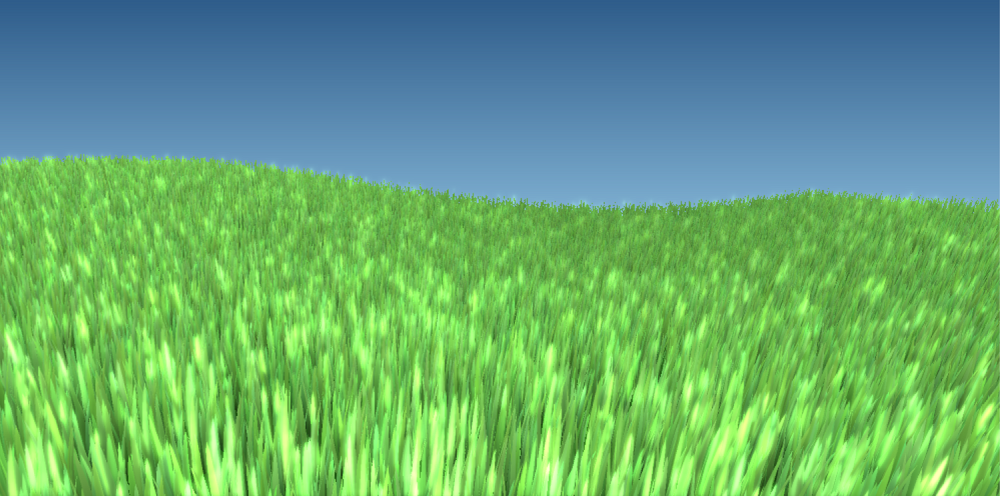

# Grass



This demo renders 160k individually animated blades of grass, and runs at a cool 200fps on a GTX 970 with essentially zero cpu utilization.

The goal is to show off some more advanced capabilities with Vulkan.

There is still some bloat left to cut down on, so check back soon!

### Deferred Rendering

Instead of targeting the swapchain, we can target a group of images to render different buffers to.

Here, I'll render color and emissive, which is used for the bloom effect.

```c++
colorTarget = vctx->makeImage(vk::ImageUsageFlagBits::eColorAttachment | vk::ImageUsageFlagBits::eSampled, size, vk::Format::eR8G8B8A8Unorm);
emissiveTarget = vctx->makeImage(vk::ImageUsageFlagBits::eColorAttachment | vk::ImageUsageFlagBits::eSampled, size, vk::Format::eR8G8B8A8Unorm);

//..
//Allocate texture memory and create views
//...

sceneRenderer->targetImages({
  colorTarget,
  emissiveTarget
}, true);
```

We can configure our shader to write to these outputs in glsl:

```c++
layout (location = 0) out vec4 OutColor;
layout (location = 1) out vec4 OutEmissive;
```

Then we can use semaphores so that the final render pass must wait for the scene to finish rendering before compositing images:

```c++
sceneTask->execute(false, {}, { sceneSemaphore });
//Final compositing task waits on scene render and swapchain to signal that buffers are ready for IO
finalTask->execute(true, { swapchain->getSemaphore(), sceneSemaphore });

```
Semaphores provide a greatly simplified form of thread scheduling on the gpu.

### Instanced Rendering

Instanced rendering is easily accomplished by setting the parameter in the draw call.
We only need pass a single blade of grass into a vbo, and render it many, many times.

```c++
cmd->draw(verticesPerBlade, 160000, 0, 0);
```

Then we can access this index in our shader to configure every blade of grass:

```c++
int x = gl_InstanceIndex / gridSize;
int z = gl_InstanceIndex % gridSize;
//Do shader magic
```

### OpenGL backwards compatibility

Premultiply the glm projection matrices by the included fix to get OpenGL clipping coordinates into Vulkan coordinates.

```c++
usb.perspective = VULCRO_glProjFixYZ * glm::perspective(
				radians(60.0f), 
				(float)windowSize.x / (float)windowSize.y, 
				1.0f, 100.0f);
```


