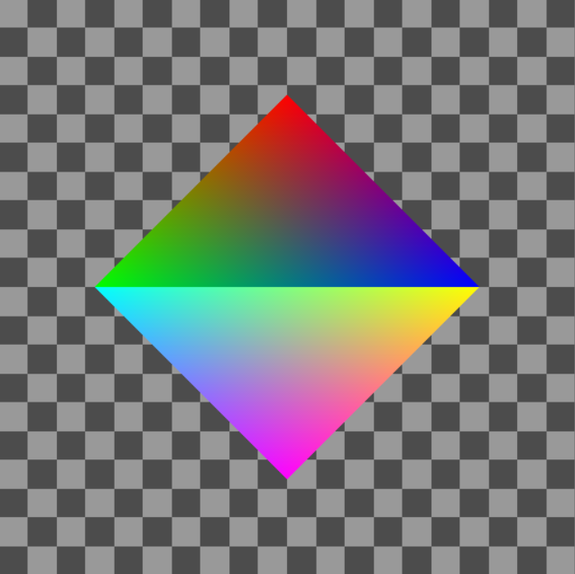

# Raytracing


This sample shows the basics for rendering triangles with raytracing. In order to run this code, you will need an RTX card from nvidia.

First we can create a vertex buffer to store our scene geometry. 
```c++
std::vector<Vertex> verts = std::vector<Vertex>({
  {glm::vec4(0.0, -1.0, 0.0, 1.0), red},
  {glm::vec4(1.0, 0.0, 0.0, 1.0), blue},
  {glm::vec4(-1.0, 0.0, 0.0, 1.0), green},

  {glm::vec4(0.0, 1.0, 0.0, 1.0), purple},
  {glm::vec4(1.0, 0.0, 0.0, 1.0), yellow},
  {glm::vec4(-1.0, 0.0, 0.0, 1.0), cyan}
});

auto vbuf = vctx->makeVBO<Vertex>(
  {
    vk::Format::eR32G32B32A32Sfloat, //Position
    vk::Format::eR32G32B32A32Sfloat  //Color
  }
, verts.size(), verts.data());

auto ibuf = vctx->makeIBO({
  0, 1, 2
});
```

It's good practice to allocate a few large buffers rather than many small ones to store geometry data. So, we can create windows into this main buffer for our two triangles by specifying the start index and index count in this overloaded version of makeVBO. This way, we can also bind this buffer as a storage buffer to a shader so that we can sample the color information during raytracing, or even modify the position values in a compute pass.

```c++
auto topTriangleVB = vctx->makeVBO(vbuf, 0, 3);
auto bottomTriangleVB = vctx->makeVBO(vbuf, 3, 3);
```

Then we build an RTScene, which is a wrapper for Vulkan's acceleration structure primitives.

```c++
auto rayScene = vctx->makeRayTracingScene();

rayScene->addGeometry(RTGeometry(ibuf, topTriangleVB));
rayScene->addGeometry(RTGeometry(ibuf, bottomTriangleVB));

auto buildSceneTask = vctx->makeTask(BUILD_SCENE_POOL, false);

buildSceneTask->record([&](vk::CommandBuffer * cmd) {
	rayScene->build(cmd);
});

buildSceneTask->execute(true);
```

We can call buildSceneTask->execute() whenever we wish to rebuild the scene, which is necessary if the positional data in the vertex buffer changes.

Now we set up our raytracing pipeline and shaders. First create a set to bind the acceleration structure, output image and vertex storage buffer. The RayTracingShaderBuilder is useful for linking all the shader modules we might use. 

```c++
auto rtSet = vctx->makeSet({
  {1, vk::DescriptorType::eAccelerationStructureNV},
  {1, vk::DescriptorType::eStorageImage},
  {1, vk::DescriptorType::eStorageBuffer}
});

auto rtShader = vctx->makeRayTracingShaderBuilder("shaders/ray_gen.spv", {
  rtSet->getLayout()
});

rtShader->addHitGroup("shaders/ray_chit.spv", nullptr);
rtShader->addMissGroup("shaders/ray_miss.spv");

auto rtPipeline = vctx->makeRayTracingPipeline(rtShader);

rtSet->bindRTScene(0, rayScene);
rtSet->bindStorageImage(1, colorTarget);
rtSet->bindBuffer(2, vbuf->getSharedBuffer());

auto rtTask = vctx->makeTask(BUILD_SCENE_POOL, false);

rtTask->record([&](vk::CommandBuffer * cmd) {

  colorTarget->transitionLayout(cmd, vk::ImageLayout::eGeneral);

  rtPipeline->bind(cmd);
  rtPipeline->bindSets(cmd, { rtSet });
  rtPipeline->traceRays(cmd, glm::uvec2(512, 512));

});

rtTask->execute(true);
```
The rtTask can be called executed when we wish to re-render the scene.

The rest of the code is largely the same as before.